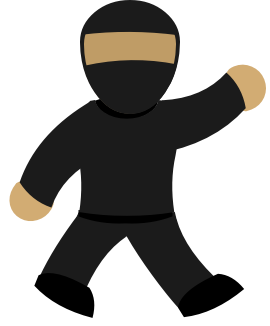
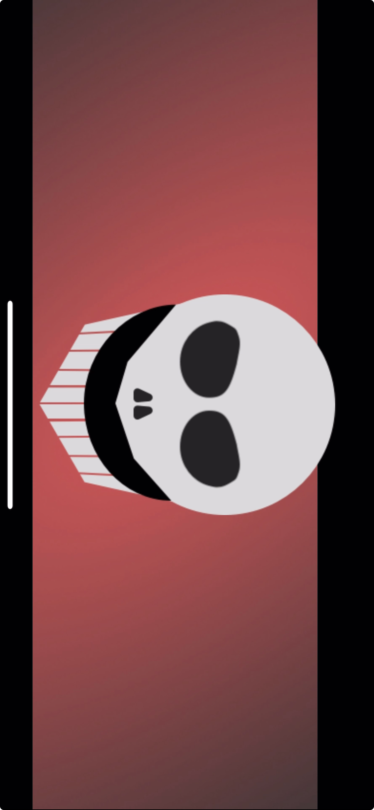

<!-- PROJECT LOGO -->
 

  

<!-- ABOUT THE PROJECT -->
# Personal Project - Shuriken Shooter Game

This project is a 2D arcade-style video game developed using SpriteKit. Players shoot shurikens by tapping the screen, and the objective is to eliminate incoming monsters flying from the right side of the screen. The game is won by shooting a set number of monsters, while allowing any monsters to pass results in a loss. 

## Motivation & Process

I initially created this game by following a tutorial, which served as a great introduction to SpriteKit and its core concepts. While following it, I made a point to thoroughly document & fully understand everything I was doing. and after completing the tutorial, I continued to explore SpriteKit's capabilities by making adjustments and enhancements to the game, including haptics that play when you touch the screen, monsters that randomly change colors as they spawn, and sprites that I designed. 

In addition to teaching me some of the fundamentals of SpriteKit, commenting on and adjusting my code really helped me gain a deeper understanding of Swift and the process of designing & developing a game. 

(<a href="#readme-top">back to top</a>)

<!-- LESSONS LEARNED -->
## Lessons Learned
* Fundamentals of SpriteKit 
  * adding & running SKActions; putting them together in a sequence
  * adding SpriteKit nodes to a game scene
  * applying physics to sprites and the game scene
  * handling contacts and collisions between physics bodies
  
* Using classes, subclasses, and inheritance 

* Using CHHapticEngine; making & playing custom haptic patterns
* Understanding bitmasks and logical operators
* Understanding retain cycles

(<a href="#readme-top">back to top</a>)

<!-- FUTURE GOALS -->
## Future Goals
* Currently learning about GameplayKit and working on refactoring my code to use it
  * using entities and components to set up a more reusable structure that will make it easier to add other things to the game
* Currently working on adding a boss to the game that takes longer to kill

> [!NOTE]
> It isn't functional yet, but I'm working on the above things in the "boss" branch.

* Adding different enemy types that move in different ways
* Adding player movement
* Adding score-tracking and a leaderboard

(<a href="#readme-top">back to top</a>)

## Demo

https://github.com/kitcurio/PewPyu/assets/80923104/bebeaa31-3c0f-4f3e-ae06-bc3dd25facb8

https://github.com/kitcurio/PewPyu/assets/80923104/3bd24e28-a4fb-4b3a-87ca-a815ab31fcd2

### Splash screen
---

(<a href="#readme-top">back to top</a>)

## Acknowledgement 

This project was built with guidance and inspiration from Kodeco's [SpriteKit beginner tutorial](https://www.kodeco.com/71-spritekit-tutorial-for-beginners). 

<!-- MARKDOWN LINKS & IMAGES -->
<!-- https://www.markdownguide.org/basic-syntax/#reference-style-links -->

